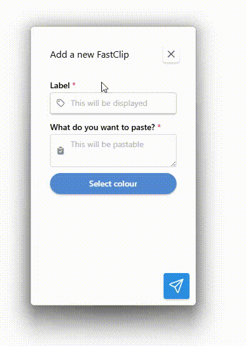

# FastClip
<p align="center">
  
</p>


FastClip is a Windows desktop application built with [Tauri](https://tauri.app/) that allows users to create and manage macro buttons for quickly copying predefined text snippets to the clipboard.

>**DO NOT USE FOR PASSWORDS!**


## Overview

FastClip is designed to streamline repetitive text-copying tasks by allowing users to create customizable macro buttons. Each button is assigned a predefined text snippet, which is copied to the clipboard with a single click. This tool is ideal for developers, customer support agents, and anyone who frequently needs to paste standard text responses or code snippets.

Key benefits of FastClip:

- Saves time by reducing manual copying and pasting.
- Simple and intuitive UI for managing macros.
- Lightweight and fast, powered by Tauri for minimal resource usage.
- Secure local storage for user-defined macros.
- Cross-platform potential with a focus on Windows.
- With FastClip, you can optimize your workflow and increase productivity effortlessly.


## Features

- Create customizable macro buttons
- Store predefined text snippets
- Click a button to instantly copy the text to the clipboard
- Choose the colour of your button
- Keep window always ontop

## Installation

To install FastClip, download the NSIS executable and follow the installation instructions.

## Usage



## Configuration

There are no contribution for the moment. The only setting is wether the app stays on top or not. 
The clipboards are saved unencripted in appdata, hence why it must not be used for passwords.

## Building from Source

The project is build with Tauri and React. The CSS framework used is [mantine](https://mantine.dev)

### Prerequisites

- Rust & Cargo installed
- Node.js & npm installed

### Steps

1. Clone this repository:
   ```sh
   git clone <repo_url>
   cd <repo_name>
   ```
2. Install dependencies:
   ```sh
   npm install
   ```
3. Build and run the application:
   ```sh
   npm run tauri dev
   ```

## Contributing

This is an early proof of concept. I think the app could get help with nice css animation to make it more intuitive. 
Maybe add more features. If I ever get traction, maybe we can improve this. 
If you want to help out, we will organise the contribution if I ever get some feedback

## License

 <p xmlns:cc="http://creativecommons.org/ns#" xmlns:dct="http://purl.org/dc/terms/"><span property="dct:title">FastClip</span> by <span property="cc:attributionName">wlwatkins</span> is licensed under <a href="https://creativecommons.org/licenses/by/4.0/?ref=chooser-v1" target="_blank" rel="license noopener noreferrer" style="display:inline-block;">CC BY 4.0</a></p> 