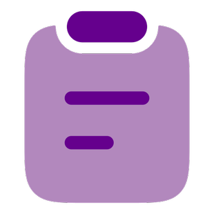
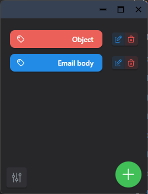
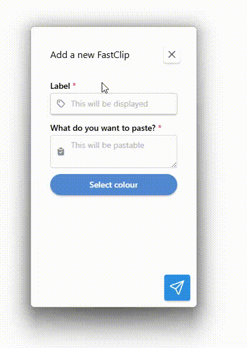

# FastClip

<p align="center">
  
</p>

FastClip is a Windows desktop application built with [Tauri](https://tauri.app/) that allows users to create and manage macro buttons for quickly copying predefined text snippets to the clipboard.

>**DO NOT USE FOR PASSWORDS!**

## Overview

FastClip is designed to streamline repetitive text-copying tasks by allowing users to create customisable macro buttons. Each button is assigned a predefined text snippet, which is copied to the clipboard with a single click. This tool is ideal for developers, customer support agents, and anyone who frequently needs to paste standard text responses or code snippets.

Key benefits of FastClip:

- Saves time by reducing manual copying and pasting.
- Simple and intuitive UI for managing macros.
- Lightweight and fast, powered by Tauri for minimal resource usage.
- Secure local storage for user-defined macros.
- Cross-platform potential with a focus on Windows.
- With FastClip, you can optimise your workflow and increase productivity effortlessly.



## Features

- Create customisable macro buttons
- Store predefined text snippets
- Click a button to instantly copy the text to the clipboard
- Choose the colour of your button
- Keep window always on top

## Installation

To install FastClip, download the NSIS executable and follow the installation instructions.

## Usage


## Configuration

There are no contributions at the moment. The only setting is whether the app stays on top or not.
The clipboards are saved unencrypted in appdata, hence why it must not be used for passwords.

## Building from Source

The project is built with Tauri and React. The CSS framework used is [Mantine](https://mantine.dev).

### Prerequisites

- Rust & Cargo installed
- Node.js & npm installed

### Steps

1. Clone this repository:
   ```sh
   git clone <repo_url>
   cd <repo_name>
   ```
2. Install dependencies:
   ```sh
   npm install
   ```
3. Build and run the application:
   ```sh
   npm run tauri dev
   ```

## Todo

- [ ] Add a tray icon with right-click copy functionality.
- [ ] Encrypt the database.
- [ ] Switch to SurrealDB.
- [ ] Improve the UI with better animations.
- [ ] Add file copy functionality.
- [ ] Implement keyboard shortcuts for quick macro activation.
- [ ] Support multiple clipboard entries with history.
- [ ] Cloud synchronization for macros across devices.
- [ ] Export and import macros as JSON files.
- [ ] Fix UI when editing label delete window not updated


## Contributing

This is an early proof of concept. I think the app could benefit from nice CSS animations to make it more intuitive.
Maybe add more features. If I ever get traction, perhaps we can improve this.
If you want to help out, we will organise the contribution if I ever receive some feedback.

## Licence

 <p xmlns:cc="http://creativecommons.org/ns#" xmlns:dct="http://purl.org/dc/terms/"><span property="dct:title">FastClip</span> by <span property="cc:attributionName">wlwatkins</span> is licensed under <a href="https://creativecommons.org/licenses/by/4.0/?ref=chooser-v1" target="_blank" rel="license noopener noreferrer" style="display:inline-block;">CC BY 4.0</a></p> 